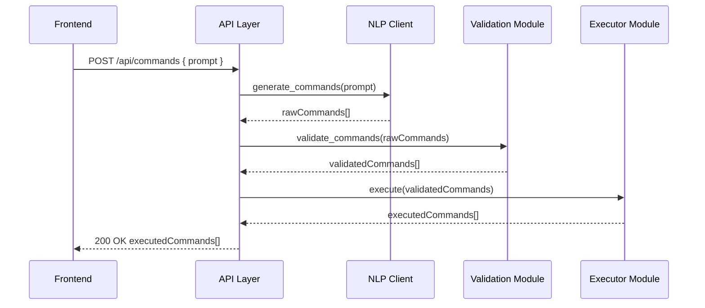

# ARCHITECTURE.md

## 1. Overview

This document describes the system architecture for the NLP-Atomic-Backend service. It covers:

* High-level component diagram showing the interaction between the Frontend and Backend.
* Detailed backend component boundaries: API Layer, NLP Client, Validation Module, Executor Module, Utilities, and Static/File Handling.
* Data flow from the incoming request through command generation, validation, execution, and response.

Refer to **PLANNING.md** for strategic context, **JSON\_SCHEMA.md** for command definitions, and **MODULE\_SPEC.md** for function signatures.

---

## 2. High-Level Architecture Diagram

```mermaid
flowchart LR
    subgraph Frontend Application
      A[Chat UI] -- Prompt --> B[POST /api/commands]
      C[Command Dispatcher] <-- Commands -- B
      C --> D[ViewerController]
      D --> E[3Dmol.js Viewer]
    end

    subgraph Backend Service
      B[POST /api/commands] --> F[API Layer]
      F --> G[NLP Client]
      G --> H[Raw Command JSON]
      H --> I[Validation Module]
      I --> J[Command Objects]
      J --> K[Executor Module]
      K --> L[Executed Commands with Results]
      L --> F --> C
    end
```

---

## 3. Backend Module Boundaries

### 3.1 API Layer (`app.py`)

* **Responsibility:** Exposes `POST /api/commands`, handles CORS, request parsing, top-level error handling.
* **Workflow:**

  1. Receive JSON body with `prompt` (and optional `context`).
  2. Call **NLP Client** to generate raw commands.
  3. Pass raw commands to **Validation Module**.
  4. Dispatch validated commands to **Executor Module**.
  5. Return executed command list as JSON to frontend.

### 3.2 NLP Client (`nlp/llm_client.py`)

* **Responsibility:** Integrates with OpenAI API, defines function schemas, constructs few-shot prompts, and extracts raw command JSON.
* **Key Functions:**

  * `generate_commands(prompt: str, context: List[dict] = None) -> List[dict]`

### 3.3 Validation Module (`models/commands.py`)

* **Responsibility:** Ensures raw JSON commands conform to schemas defined in **JSON\_SCHEMA.md**.
* **Key Functions:**

  * Pydantic models for each command’s `params`.
  * `validate_commands(raw: List[dict]) -> List[Command]`.

### 3.4 Executor Module (`executor/`)

* **Responsibility:** Executes business logic for each command type.
* **Submodules:**

  * **Structure Executor** (`structure.py`): `build_structure`, returns raw file text.
  * **View Executor** (`view.py`): `compute_set_view`, `compute_rotate_camera`, returns `viewObject`.

### 3.5 Utilities (`utils/`)

* **Responsibility:** Shared helper functions and classes.
* **Key Components:**

  * `file_utils.py`: In-memory file generation or path management.
  * `error_handlers.py`: Exception classes and mapping to HTTP responses.
  * `logging.py`: Central logger configuration.

### 3.6 Static/File Handling

* **Responsibility:** Decide on returning raw file text (V1) or serving static model files.
* **Implementation:** V1 returns model data in the `content` field of `buildStructure` commands.

---

## 4. Data Flow Details

1. **Frontend** (Chat UI) sends `POST /api/commands` with `{ prompt, context }`.
2. **API Layer** parses request and calls `generate_commands()` with the prompt.
3. **NLP Client**:

   * Constructs OpenAI ChatCompletion call with system prompt, function schemas, and few-shot examples.
   * Receives raw JSON commands from LLM.
4. **Validation Module** parses each raw JSON object using Pydantic:

   * Ensures `command` is one of the allowed enums.
   * Ensures `params` object matches the schema (types, required fields).
   * Throws `ValidationError` on mismatch.
5. **Executor Module** iterates validated command objects:

   * For `buildStructure`, call ASE to build supercell, capture file text.
   * For view commands, compute `viewObject` or axis/angle.
   * For each, produce an executed command with final `params`.
6. **API Layer** collects executed commands and returns them in a JSON array.
7. **Frontend** receives command array, and the **Command Dispatcher** invokes `ViewerController` methods accordingly.

---

## 5. Sequence Diagram for a Sample Request



---

## 6. Additional Notes

* **Scalability:** This modular design allows splitting the NLP client and executor into separate services if needed in the future.

* **Extensibility:** Adding new commands requires updates to:

  * **JSON\_SCHEMA.md** (new `Params` schema)
  * **nlp\_client.py** (OpenAI function schema)
  * **models/commands.py** (Pydantic model)
  * **executor/** (handler implementation)

* **Monitoring & Logging:** Instrument each boundary with structured logs to trace latency and errors.

---

*End of ARCHITECTURE.md*
